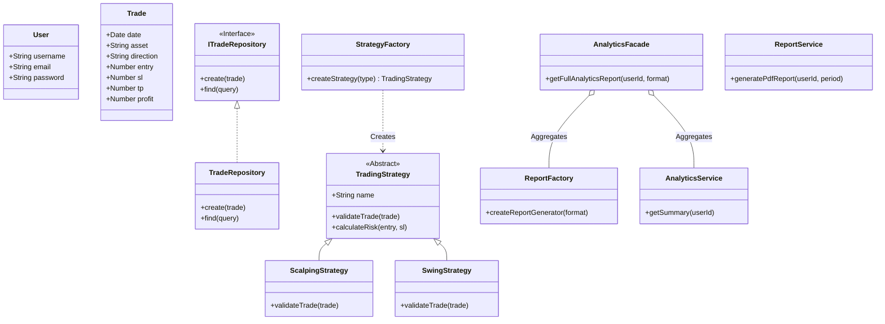
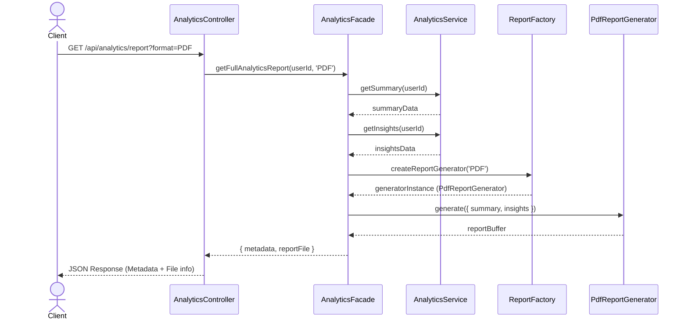
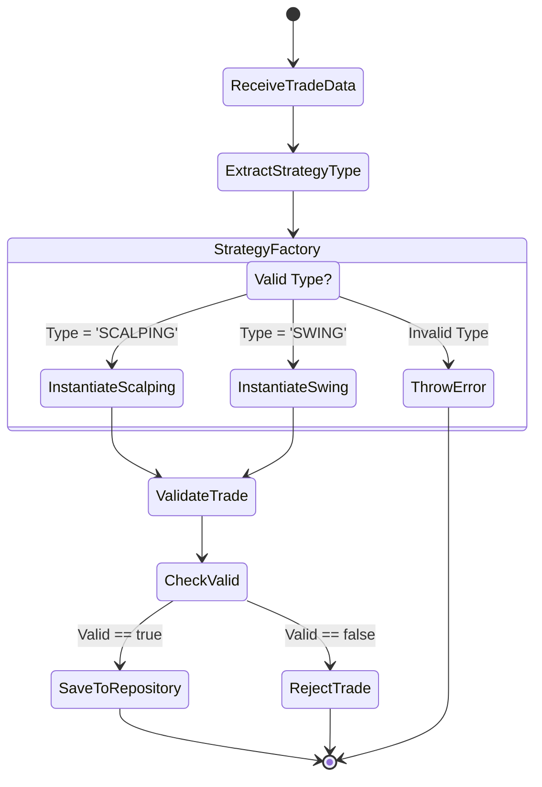
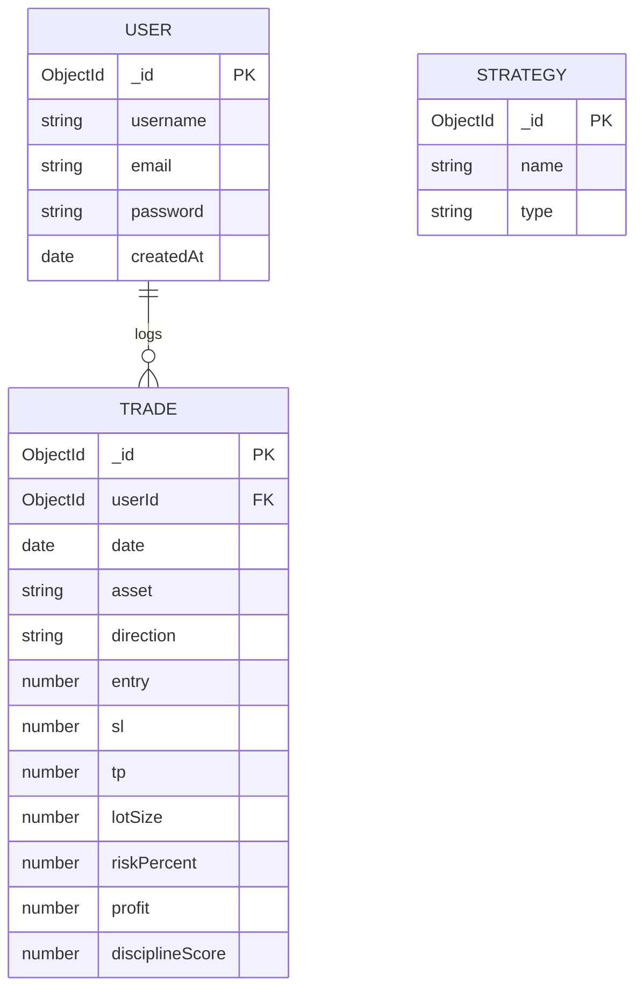

# Trading Journal UML Documentation

This document contains Mermaid diagrams visualizing the architecture and workflow of the Trading Journal backend, emphasizing the OOP design patterns (Strategy, Factory, Facade) implemented.

## 1. UML Class Diagram
Illustrates the core structural relationships between Domain objects, Repositories, Services, Factories, and Facades.



## 2. UML Use Case Diagram
Visualizes the actors and their interactions with the system.

```mermaid
usecaseDiagram
    actor Trader
    
    package "Trading Journal System" {
        usecase "Login / Register" as UC1
        usecase "Log a Trade" as UC2
        usecase "View Trade History" as UC3
        usecase "View Analytics Summary" as UC4
        usecase "Generate Full Report (PDF/CSV)" as UC5
        usecase "Validate Strategy" as UC6
    }
    
    Trader --> UC1
    Trader --> UC2
    Trader --> UC3
    Trader --> UC4
    Trader --> UC5
    UC2 .> UC6 : <<includes>>
```

## 3. UML Sequence Diagram
Visualizes the flow of generating a full analytics report via the Facade pattern.



## 4. UML Activity Diagram
Visualizes the process of validating a trade against a specific strategy before saving.



## 5. ER Diagram
Visualizes the database entities and their relationships.


